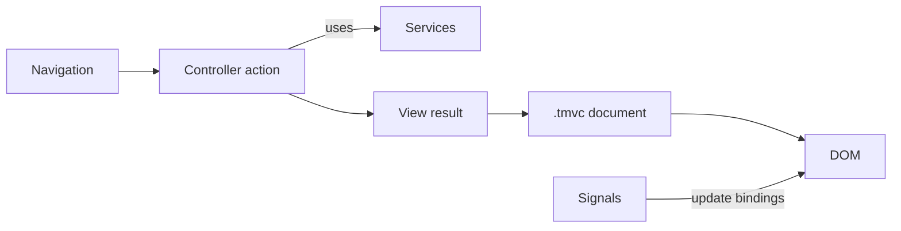

# TypeMVC

[](https://www.npmjs.com/package/@typemvc/core)
[](https://github.com/coretravis/typemvc/actions/workflows/ci.yml)
[](https://tmvc.coretravis.work)
[](./LICENSE)

**Controller-led applications. Typed document views. Fine-grained DOM updates.**

TypeMVC is a browser-first TypeScript framework for applications that need a
clear architectural spine without giving up reactive UI.

A navigation selects a controller action. The action coordinates services and
returns a view result. A `.tmvc` document renders the typed result. Signals
update only the DOM bindings that depend on them.



There is no JSX, virtual DOM, server renderer, or component tree acting as the
application's dependency and workflow system.

> **Project status:** TypeMVC 0.3 is under active development. It is suitable
> for evaluation and controlled use, but breaking changes may occur before 1.0.
> The runtime is browser-only; TypeMVC does not provide SSR, hydration, or server
> endpoints.

## Start a project

```bash
npm create @typemvc@latest my-app
cd my-app
npm install
npm run dev
```

The initializer creates a Vite application with TypeScript configured, the
TypeMVC compiler installed, and a working controller, view, component, and
catch-all route. Node.js 20 or newer is required by the toolchain.

`pnpm create @typemvc my-app` and `yarn create @typemvc my-app` work as well.

## The application model

A small form shows the complete request path: routing, dependency injection,
typed body binding, validation, a view model, and a document response.

```ts
// src/features/members/CreateMemberInput.ts
import { dataType, email, minLength, required } from '@typemvc/core';

export class CreateMemberInput {
  @dataType('string')
  @required('Enter a name.')
  @minLength(2, 'Use at least two characters.')
  displayName = '';

  @dataType('string')
  @required('Enter an email address.')
  @email('Enter a valid email address.')
  emailAddress = '';
}
```

```ts
// src/controllers/MembersController.ts
import { Controller, Redirect, View, body, controller, get, inject, post } from '@typemvc/core';
import type { IView } from '@typemvc/core';
import { CreateMemberInput } from '../features/members/CreateMemberInput.js';
import { MEMBERS } from '../services/tokens.js';
import type { MemberService } from '../services/MemberService.js';

type MemberForm = { draft: CreateMemberInput };

@controller('members')
export class MembersController extends Controller {
  constructor(@inject(MEMBERS) private readonly members: MemberService) {
    super();
  }

  @get('new')
  newMember(): IView<MemberForm> {
    return View('members/new', { draft: new CreateMemberInput() });
  }

  @post()
  create(@body(CreateMemberInput) input: CreateMemberInput): IView<MemberForm> {
    if (this.hasErrors()) {
      return View('members/new', { draft: input });
    }

    const emailAddress = input.emailAddress.trim().toLowerCase();

    if (this.members.hasEmail(emailAddress)) {
      this.addError('emailAddress', 'A member already uses this email address.');
      return View('members/new', { draft: input });
    }

    this.members.create({
      displayName: input.displayName.trim(),
      emailAddress,
    });

    return Redirect('/members');
  }
}
```

```typescript
@model from MembersController.create

<main>
  <h1>Create member</h1>

  <form method="post" action="/members" novalidate>
    <div>
      <label for="display-name">Name</label>
      <input
        id="display-name"
        name="displayName"
        value="${context.model.draft.displayName}"
        aria-invalid="${context.errors.displayName ? 'true' : 'false'}"
        aria-describedby="${context.errors.displayName ? 'display-name-error' : undefined}"
      />
      ${context.errors.displayName
        ? html`<p id="display-name-error" class="field-error">${context.errors.displayName}</p>`
        : ''}
    </div>

    <div>
      <label for="email-address">Email</label>
      <input
        id="email-address"
        name="emailAddress"
        type="email"
        value="${context.model.draft.emailAddress}"
        aria-invalid="${context.errors.emailAddress ? 'true' : 'false'}"
        aria-describedby="${context.errors.emailAddress ? 'email-address-error' : undefined}"
      />
      ${context.errors.emailAddress
        ? html`<p id="email-address-error" class="field-error">${context.errors.emailAddress}</p>`
        : ''}
    </div>

    <button type="submit">Create member</button>
  </form>
</main>
```

`@model from MembersController.create` connects the document to the action's
return type, so the editor knows the shape of `context.model`. When the browser
submits the form, the router matches `@post`, constructs the DTO declared by
`@body`, checks presence before coercion, and runs its validators. The controller
can add business errors to the same field-error surface. Invalid input redisplays
the attempted values; success redirects so refreshing does not replay the
mutation.

For eager feedback before submission, the same DTO can drive `useForm()` in a
component. Submission still belongs to the HTML form and controller action.

Register the route and view modules once at application startup:

```ts
// src/main.ts
import { bootstrap } from '@typemvc/core';
import { MembersController } from './controllers/MembersController.js';
import { NotFoundController } from './controllers/NotFoundController.js';
import { MemberService } from './services/MemberService.js';
import { MEMBERS } from './services/tokens.js';

const outlet = document.getElementById('app');
if (outlet === null) throw new Error('Missing #app outlet');

const app = bootstrap({
  outlet,
  viewsRoot: '/src/views/',
  views: import.meta.glob('/src/views/**/*.tmvc'),
  components: import.meta.glob('/src/components/**/*.tmvc', { eager: true }),
  configure(builder) {
    builder.singleton(MEMBERS, () => new MemberService());
    builder.route(MembersController);
    builder.route(NotFoundController);
  },
});

await app.ready;
```

Views are loaded lazily by route. Components are registered eagerly so a
component tag can be resolved when a view renders.

## One owner for each concern

TypeMVC is opinionated about where code belongs:

| Layer          | Owns                                                                    | Does not own                                                   |
| -------------- | ----------------------------------------------------------------------- | -------------------------------------------------------------- |
| **Controller** | Route workflow, validation decisions, view results, activation lifetime | Reusable domain or data-access logic                           |
| **Service**    | Domain behavior, persistence, remote calls, cross-feature work          | Markup or route presentation                                   |
| **View**       | Page structure over a typed model                                       | Mutable state, service lookup, fetching, workflow coordination |
| **Component**  | Reusable UI, props, slots, small instance-local interaction state       | Page-level application flow                                    |
| **Renderer**   | Escaping, bindings, DOM updates, ownership, disposal                    | Business decisions                                             |

This is the framework's central constraint. Components are part of the UI layer,
not the architecture of the entire application.

## `.tmvc` documents

A `.tmvc` file is HTML with TypeScript expressions and a small set of structural
directives. TypeScript is the template language: there is no separate loop,
condition, or expression syntax to learn.

Views receive `context`. Components receive typed `props` and may declare an
`@local` block for state owned by that component instance.

```ts
@props { label: string; initial?: number }

@local {
  const count = signal(props.initial ?? 0);
  const increment = () => count.update((value) => value + 1);
}

<button type="button" class:is-active="${count.get() > 0}" onclick="${increment}">
  ${props.label}: ${count}
</button>
```

The compiler also supports layouts, partials, named slots, `@use` module values,
colocated `.tmvc.css` files, SVG, refs, event modifiers, keyed lists, and focused
`class:` and `style:` bindings.

See the [`.tmvc` file format](./docs/tmvc-file-format.md) for the complete syntax.

## Framework surface

TypeMVC provides one integrated runtime rather than a collection of unrelated
libraries:

- **Routing:** verb-decorated controller actions, route parameters, query access,
  guards, redirects, catch-all routes, lazy views, cancellation, controller
  retention, pending states, and failure states.
- **Dependency injection:** symbol tokens, constructor injection, singleton,
  scoped, and transient lifetimes, plus startup tasks for application-wide work.
- **View composition:** typed views, layouts, partials, components, props, default
  and named slots, and colocated stylesheets.
- **Reactivity:** signals, computed values, effects, reactive records, keyed lists,
  batching, and ownership-aware cleanup.
- **Forms:** DTO binding, coercion, declarative validators, custom validators,
  controller errors, and `useForm` for eager field state using the same rules.
- **Browser experience:** route titles, screen-reader announcements, history,
  scroll handling, and view transitions that respect reduced-motion preferences.
- **Observability:** structured logging and application, action, lifecycle, and
  rendering error boundaries.
- **Testing:** controller, guard, form, view, component, reactivity, and Vitest
  helpers supplied by the framework.

Headless browser behaviours live in `@typemvc/core/behaviors`: `persisted`,
`mediaQuery`, `hotkey`, and `clickOutside`. They carry no visual policy and bind
their cleanup to the component that owns them.

## Rendering and safety

TypeMVC renders directly to the DOM. A signal read in a text node, attribute, or
reactive region creates a focused subscription for that binding. Unrelated DOM is
not diffed or recreated.

Dynamic text is escaped by default. URL-bearing attributes are checked by the
renderer. Raw HTML requires the explicit `safeHtml()` boundary. These defaults
reduce common template mistakes; they do not turn application code or untrusted
business data into a security sandbox.

Effects, event handlers, refs, child fragments, component state, and cleanup
callbacks are owned by the fragment that created them and are released when that
fragment is removed.

## Documentation

Read the complete documentation at
[tmvc.coretravis.work](https://tmvc.coretravis.work).

It covers installation, application structure, controllers, routing, dependency
injection, `.tmvc` views, components, reactivity, forms, validation, lifecycle,
testing, and the public framework APIs.

## Tooling

The Vite plugin compiles `.tmvc` documents, validates their capability boundaries,
and emits lazy view modules and colocated CSS imports.

The [TypeMVC VS Code extension](https://marketplace.visualstudio.com/items?itemName=typemvc.tmvc-syntax)
adds syntax highlighting, completion, diagnostics, typed `context.model` and
component props, and go-to-definition for `.tmvc` files. It bundles the TypeMVC
Volar language plugin.

For tests, import framework-aware helpers from `@typemvc/core/testing` and Vitest
matchers from `@typemvc/core/testing/vitest`. See the
[testing guide](./docs/guide/testing.md).

## Add TypeMVC to an existing Vite project

```bash
npm install @typemvc/core
```

```ts
// vite.config.ts
import { defineConfig } from 'vite';
import { typemvcPlugin } from '@typemvc/core/vite';

export default defineConfig({
  plugins: [typemvcPlugin()],
});
```

Add the framework's decorator options to your TypeScript configuration, create
an outlet, then call `bootstrap()` from the browser entry point. The initializer
is the easiest source for a complete working configuration.

## Package entry points

| Import                         | Purpose                                                                                     |
| ------------------------------ | ------------------------------------------------------------------------------------------- |
| `@typemvc/core`                | Controllers, view results, rendering, reactivity, DI, validation, and application bootstrap |
| `@typemvc/core/behaviors`      | `persisted`, `mediaQuery`, `hotkey`, and `clickOutside`                                     |
| `@typemvc/core/vite`           | Production `.tmvc` compiler for Vite                                                        |
| `@typemvc/core/parser`         | Deliberately limited zero-build/runtime `.tmvc` parser                                      |
| `@typemvc/core/testing`        | Framework-aware test helpers                                                                |
| `@typemvc/core/testing/vitest` | TypeMVC Vitest matchers                                                                     |
| `@typemvc/core/volar`          | Language plugin used by the editor extension                                                |

## Fit and boundaries

TypeMVC is a good fit when:

- the application benefits from explicit controllers and services;
- pages are naturally expressed as document views;
- forms, validation, navigation, and lifecycle should share one framework model;
- reusable components are needed, but should not own application architecture;
- fine-grained updates are preferred over tree-wide rerendering.

TypeMVC is not currently a fit when the project requires:

- server-side rendering, hydration, or framework-owned server endpoints;
- React-compatible components or a JSX-first ecosystem;
- native mobile rendering;
- a mature third-party integration ecosystem with long-term 1.x stability.

The runtime targets modern browsers and is built around browser navigation and
DOM APIs. Confirm the compatibility policy before targeting legacy browsers or
embedded webviews.

## Contributing

Read [CONTRIBUTING.md](./CONTRIBUTING.md) before opening a pull request. Run the
complete local pipeline with:

```bash
pnpm run ci
```

That command runs linting, strict type checking, the test suite, and the package
build.

## License

[MIT](./LICENSE) © coretravis
